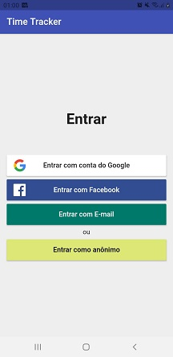
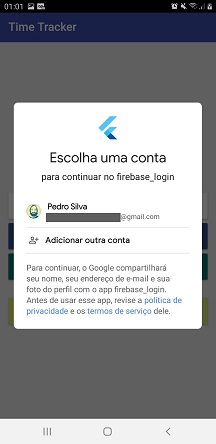
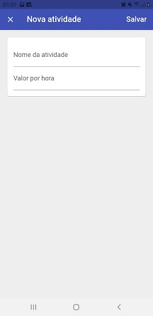
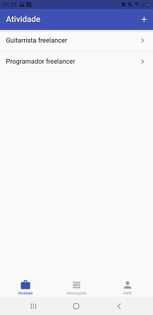
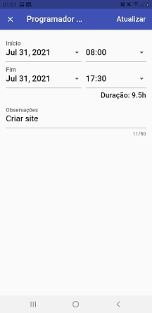
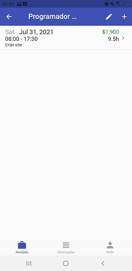
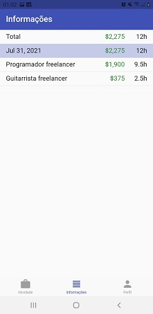

# APP TIME TRACKER COM LOGIN FIREBASE

Aplicativo em Flutter desenvolvido com os conhecimentos adquiridos nas aulas do professor Andrea Bizzotto na Udemy. 

A função desse aplicativo é a de registrar trabalhos com tempo definido e remuneração por hora. É um app integrado ao banco de dados Firebase. Possui tela de login onde seu acesso pode ser anônimo, se dar por e-mail, conta do Google ou conta do Facebook. O próprio [Firebase](https://firebase.google.com/?hl=pt "Website do Firebase") fornece orientações de instalação, porém para informações sobre como integrar login com contas do Google e Facebook é necessário acessar os sites [Google Developers](https://developers.google.com/ "Website da Google Developers")  e [Facebook Developers](https://developers.facebook.com/ "Website do Facebook Developers").

Após escolher qual o tipo de login o usuário é levado para a tela seguinte, nesse caso a conta escolhida foi do Google: 

Clicando na aba inferior “atividade” o usuário é levado para a tela de registro de atividade, onde se digita o nome da atividade e o valor a ser cobrado por hora. Depois basta salvar as informações:

Aqui já temos duas atividades registradas, para adicionar uma nova atividade basta clicar no botão “+”. Para definir a data e hora de início da atividade e seu fim basta clicar em cima de uma atividade já existente: 

Você pode definir (em uma atividade nova) ou atualizar (em uma atividade já existente) as informações do período de duração da atividade e colocar observações:

Ao salvar as informações aparecem os detalhes da atividade:

Na aba inferior “informações” é possível visualizar a data, o valor e tempo total de cada atividade:

Na aba inferior perfil a foto e nome na conta do Google são integrados ao aplicativo, e você tem a opção de fazer o logout:

